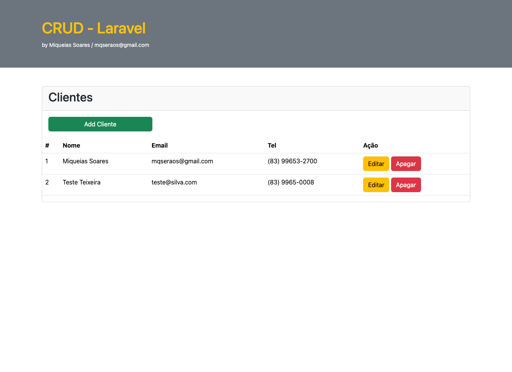
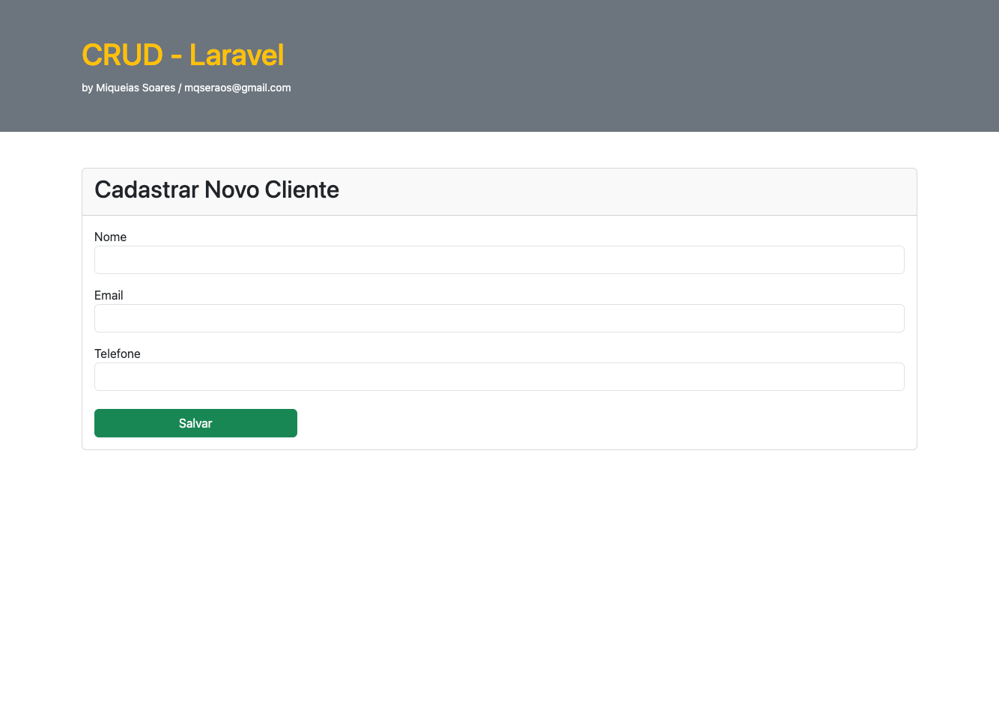
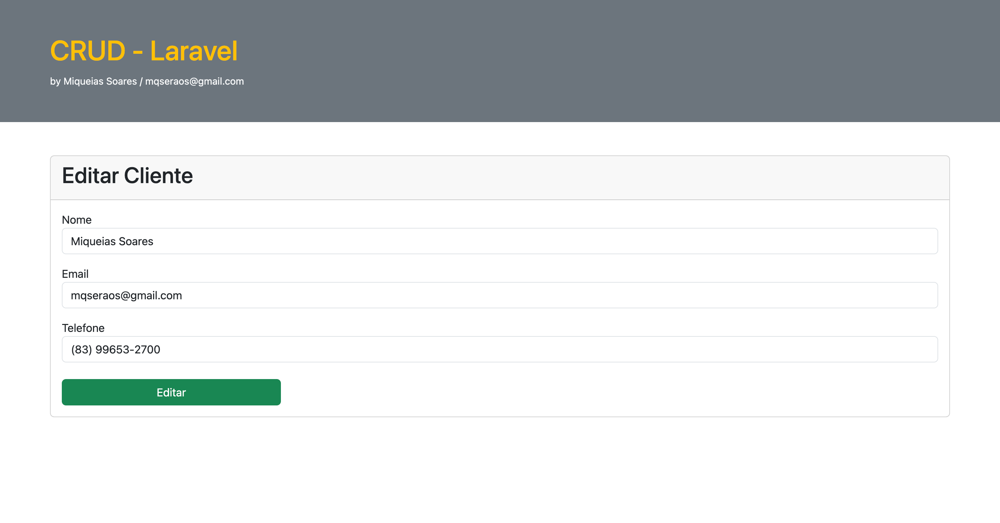
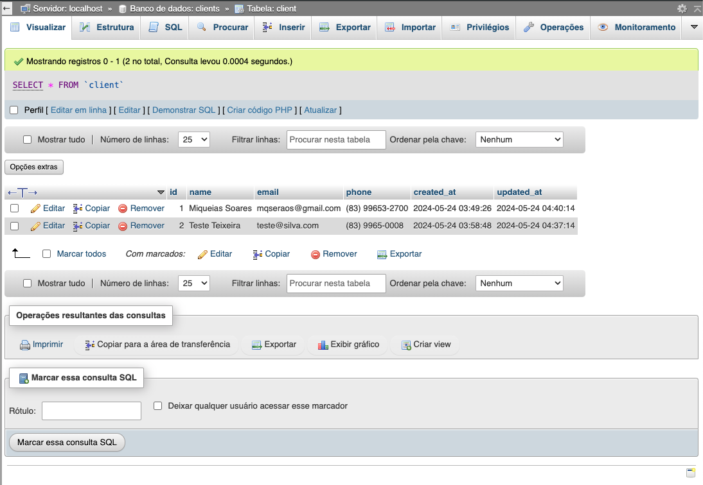

# Pós-graduação | Desenvolvimento Web Full Stack
### CRUD de Clientes
Projeto desenvolvido para obtenção de nota na disciplina de Programação Para Web com Frameworks.

## Descrição

Desenvolvido em PHP com uso do Laravel.

O projeto basicamente é um CRUD de cadastro de clientes, que utiliza o banco de dados mysql para persistência dos cadastros.
1. tabela:
   - Client: id, name, email, phone
  
## Get started

> Clonar o projeto ou baixar o zip. 
#### Install
```
$ composer install
```
#### Run
```
$ php artisan serve
```

### Prints
Lista de clientes:


Cadastrar um novo cliente:


Editar cadastro um cliente:


phpMyAdmin:

